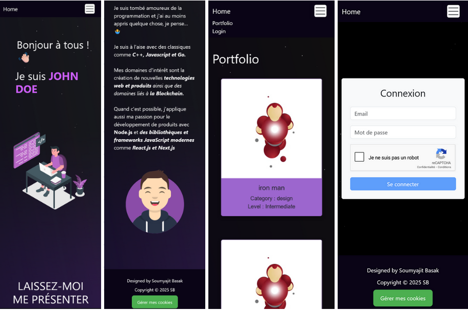
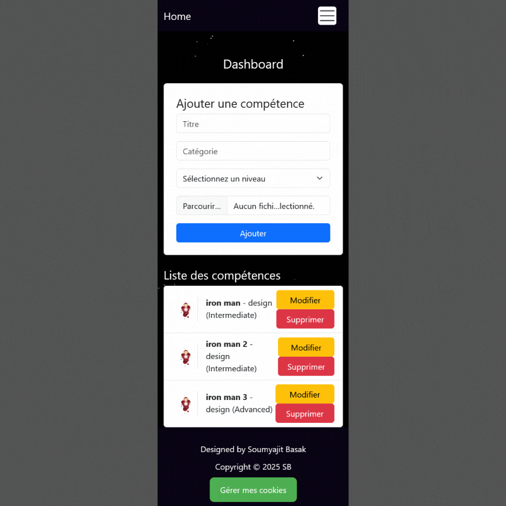

# Évaluation finale - Développeur Web & Web Mobile

## Description :

Vous allez concevoir une application MERN permettant aux utilisateurs de gérer et
afficher leurs compétences via un portfolio dynamique. L'application devra être
sécurisée, responsive (mobile-first) et conforme aux exigences RGPD avec un
système de gestion des cookies (Tarteaucitron.js) et un Captcha (Google
reCAPTCHA ou Tarteaucitron) pour sécuriser l’authentification.

Voici les [instruction](/ressources/Eval%20Backend.pdf) de l'évaluation.

## Table des matières

- [Technologies](#technologies)
- [Déploiement](#déploiement)
- [Snapshot](#snapshot)
- [Installation](#installation)
- [Utilisation](#utilisation)
- [Auteur](#auteur)

## Technologies:

## Déploiement:

- [Vercel Front-End Deployment]()
- [Render Back-end Deployment](https://projet-finale.onrender.com/)

## Snapshot:

### Mobile

### Dashboard Admin

## Installation:

### Procédure d'installation :

Cloner le repository:

`git clone https://github.com/xanbalandrau/Projet_Finale.git`

### Installation et lancement du back-end :

1. Aller dans le dossier "backend"

- `cd backend `

2. Installer toutes les dépendances pour le back-end:

- `npm install`

3. Lancer le back-end :

- `npm start`
- `npm run dev` pour les développeurs

Le back-end sera lancé à l'URL:
`http://localhost:5000`

### Installation et lancement du front-end :

1. Aller dans le dossier "frontend"

- `cd frontend`

2. Installer toutes les dépendances pour le front-end:

- `npm install`

3. Lancer le front-end:

- `npm start`

Le front-end sera lancé à l'URL:
`http://localhost:3000`

## Utilisation:

## Auteur:

**Xan Balandrau** : [**GitHub**](https://github.com/xanbalandrau/)
