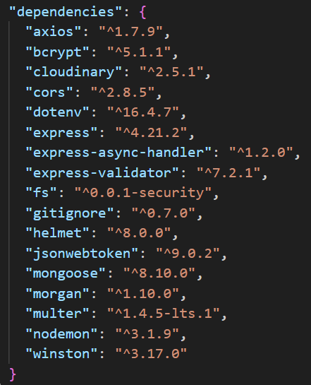

# Back-end

## Prérequis

- Node.js installé
- npm (gestionnaire de paquets)
- MongoDb (Une base de données configurée)

## Dépendance installé



## Lancé

```
npm start
```

Pour lancer en mode développement :

```
npm run dev
```

## Utilisation

Pour se connecter sur le dashboard :

```
email : xan@gmail.com
password : xan
```

## Structure du projet

```
.
├── node_modules
├── uploads
├── logs
│   ├── all.log
|
├── src/
│   ├── controllers/
│   │   ├── skillController.js
│   │   ├── userController.js
│   ├── config/
│   │   ├── db.js
│   │   ├── logger.js
│   ├── middleware/
│   │   ├── authMiddleware.js
│   │   ├── errorHandler.js
│   │   ├── morganMiddleware.js
│   │   ├── recaptchaMiddleware.js
│   ├── models/
│   │   ├── Settings.js
│   │   ├── Skills.js
│   │   ├── User.js
│   ├── routes/
│       ├── skillRoutes.js
│       ├── userRoutes.js
├── .env
├── .gitignore
├── package.json
├── README.md
├── server.js
```

- Dans .env :

```
MONGO_URI = <votre URI de connexion MongoDB>
CLOUD_NAME = <votre nom de compte Cloudinary>
API_KEY = <votre clé API Cloudinary>
API_SECRET = <votre clé secrète API Cloudinary>
JWT_SECRET = <votre clé secrète pour JWT>
RECAPTCHA_SECRET_KEY = <votre clé secrète reCAPTCHA>
```

- Dans .gitignore :

```
node_modules
.env
```

## UML


## API Endpoints

| Méthode    | Endpoint                | Description                      |
| ---------- | ----------------------- | -------------------------------- |
| **GET**    | `/api/users/`           | Liste des utilisateurs           |
| **POST**   | `/api/users/register`   | Créer un utilisateur             |
| **POST**   | `/api/users/login`      | Se connecter                     |
| **GET**    | `/api/skills/`          | Liste des skills                 |
| **POST**   | `/api/skills//addSkill` | Ajouter un skill à l'utilisateur |
| **PUT**    | `/api/skills/:id`       | Mettre à jour un skill           |
| **DELETE** | `/api/skills/:id`       | Supprimer un skill               |

## Middleware

- authMiddleware.js : Vérifie si l'utilisateur est authentifié
- errorHandler.js : Gestion des erreurs globales
- morganMiddleware.js : Logger HTTP avec Morgan
- recaptchaMiddleware.js : Vérifie si l'utilisateur à passer le test
