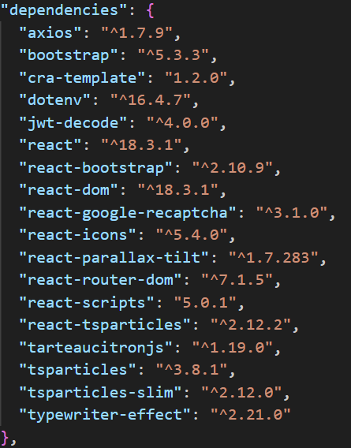

# Front-end

## Prérequis

- Node.js installé
- npm (gestionnaire de paquets)
- Connaissance React

## Dépendance installé



## Lancé

Installation des dépendances:

`npm i`

Lancement du projet:

`npm start`

L'application sera accessible à http://localhost:3000/ par défaut.

## Utilisation

Pour se connecter sur le dashboard :

```
email : xan@gmail.com
password : xan
```

## Structure du projet

Ce projet suit une architecture modulaire et bien organisée en React, facilitant la scalabilité et la maintenance.

```
/frontend
│── /node_modules
│── /public
│   ├── index.html
│── /src
│   ├── /Assets
│   │   ├── avatar.svg
│   │   ├── home-bg.jpg
│   │   ├── home-main.svg
│   ├── /components
│   │   ├── card
│   |   │   ├── Cards.jsx
│   │   ├── partials
│   |   │   ├── ButtonCookies.jsx
│   |   │   ├── Footer.jsx
|   │   │   ├── Navbar.jsx
|   │   │   ├── Particle.jsx
│   │   ├── context
|   │   │   ├── AuthContext.js
│   │   ├── pages
│   |   │   ├── Home
│   |   |   │   ├── Home.jsx
│   |   |   │   ├── Home2.jsx
│   |   |   │   ├── Type.jsx
│   |   │   ├── Login
│   |   |   │   ├── Login.jsx
│   │   |   ├── Dashboard.jsx
│   │   |   ├── Portfolio.jsx
│   |   ├── /routes
│   │   |   ├── AdminRoutes.jsx
│   │   |   ├── AppRoutes.jsx
│   |   ├── /styles
│   │       ├── App.css
│   │       ├── Cards.css
│   │       ├── Footer.css
│   │       ├── navbar.css
|   |
│   ├── App.jsx
│   ├── index.jsx
|
│── .env
│── .gitignore
│── package.json
│── README.md

```

- Dans .env :

```
REACT_APP_API_URL = <url de votre back-end>
REACT_APP_SITE_KEY = <clé de votre reCAPTCHA public>
```

## Développement

### Ajout d'un nouveau composant

1. Créer un fichier MonComposant.jsx dans /components.
2. Ajouter le code suivant :

```
import React from 'react';

const MonComposant = () => {
  return <div>Mon nouveau composant</div>;
};

export default MonComposant;
```

3.  L'importer dans une page ou un autre composant :

```
  import MonComposant from '../components/MonComposant';
```

### Gestion des Routes

- Les routes sont définies dans /routes/AppRoutes.jsx.
- Pour ajouter une nouvelle route, modifier ce fichier en ajoutant :

```
<Route path="/nouvelle-page" element={<NouvellePage />} />
```
